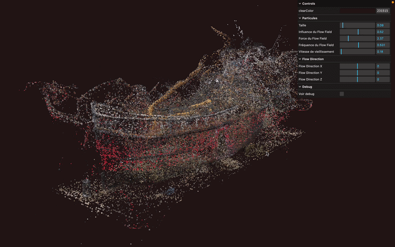

# 🌪️ Three.js – GPGPU Flow Field Particles 💨

Une scène 3D interactive transformant un modèle 3D en un nuage de milliers de particules animées par un flow field, calculé entièrement sur le GPU (GPGPU), réalisée avec [Three.js](https://threejs.org/) et des shaders GLSL personnalisés. Projet inspiré du parcours Three.js Journey par Bruno Simon.



## 🚀 Démo

[Voir la démo](https://rekuiem84.github.io/flow-field-particles-shaders/)

## ✨ Fonctionnalités

- Conversion d'un modèle 3D (`.glb`) en nuage de particules, positions extraites depuis la géométrie du modèle (voir [`./vertexColorsBlender.md`](./vertexColorsBlender.md) pour la marche à suivre côté Blender afin d'obtenir des vertex colors sur le modèle exporté)
- Simulation de position entièrement calculée sur GPU via un GPGPU (`GPUComputationRenderer`) et un FBO (Frame Buffer Object)
- Flow field procédural basé sur du bruit simplex 4D, influençant la direction et l'intensité du déplacement des particules
- Cycle de vie des particules (naissance, vieillissement, mort, reset) géré dans le fragment shader du GPGPU
- Fondu de taille des particules en entrée et en sortie de leur cycle de vie
- Contrôle via `lil-gui` pour ajuster la couleur de fond, la taille des particules et les paramètres du flow field
- Visualisation debug de la texture FBO (position/vie des particules)

## 🛠️ Installation & Lancement

1. **Cloner le dépôt :**

   ```bash
   git clone https://rekuiem84.github.io/flow-field-particles-shaders/
   cd flow-field-particles-shaders
   ```

2. **Installer les dépendances :**

   ```bash
   npm install
   ```

3. **Lancer le serveur de développement :**

   ```bash
   npm run dev
   ```

4. **Build pour la production :**

   ```bash
   npm run build
   ```

Les fichiers optimisés seront générés dans le dossier `dist/`.

## 📁 Structure du projet

```
├── src/
│   ├── script.js
│   └── shaders/
│       ├── includes/
│       │   └── simplexNoise4d.glsl
│       ├── gpgpu/
│       │   └── particles.glsl
│       └── particles/
│           ├── vertex.glsl
│           └── fragment.glsl
├── static/
│   ├── draco/
│   └── model.glb
```

## 🎛️ Paramètres ajustables (via le menu debug)

### Particules

- `uSize` : taille de base des particules

### Flow Field

- `FlowField Influence` : seuil sur le bruit déterminant la proportion de particules réellement affectées par le flow field
- `FlowField Strength` : intensité du déplacement appliqué aux particules
- `FlowField Frequency` : fréquence spatiale du bruit(bas => particules proches = mouvement cohérent entre particules voisines, haut => direction plus chaotiques même pour les particules proches)

### Debug

- `Voir debug` : affiche ou masque le plan de visualisation de la texture FBO (position des particules)

## 🧪 Shaders

### GPGPU (`gpgpu/particles.glsl`)

- Lit l'état courant de chaque particule (position + vie) depuis le FBO
- Gère le cycle de vie : reset à la position d'origine une fois la particule "morte" (`alpha >= 1`)
- Calcule un flow field à partir de bruit simplex 4D pour faire dériver les particules vivantes
- Fait vieillir les particules à chaque frame et réécrit leur nouvel état dans le FBO

### Particules – Vertex shader (`particles/vertex.glsl`)

- Lit la position de chaque particule depuis la texture FBO calculée par le GPGPU
- Applique un fondu de taille en entrée et en sortie du cycle de vie de la particule
- Calcule la taille finale du point à l'écran avec correction de perspective

### Particules – Fragment shader (`particles/fragment.glsl`)

- Colore chaque point à partir de la couleur transmise par le vertex shader

### Includes

- `simplexNoise4d.glsl` : bruit simplex 4D utilisé pour générer le flow field

## 🔗 Mes autres projets Three.js

- [Repo Three.js Journey principal](https://github.com/Rekuiem84/threejs-journey) — pour retrouver tous mes projets suivant ce parcours
